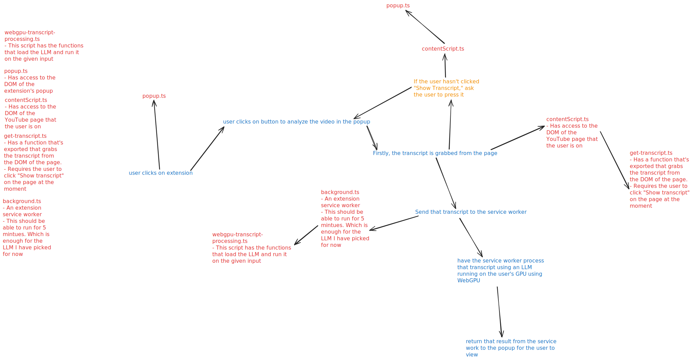

# Brainrot or Not

## Purpose

This extension is made to help you make sure you're not wasting your time watching whatever YouTube video you click on.

To help you, when you click on a video, you can click on the extension and it will analyze the video's information **on your computer** and let you know whether the video is *brainrot* -something that's just entertainment- or educational or productive, like a lecture or self-improvement video.

## Languages and Libraries

> [!NOTE]
> These are what are currently being used and may be updated to include more or less.

- HTML
- Typescript
  - multiple LangChain libraries
    - A WebGPU library to run the model on the user's browser
  - pnpm
    - For managing packages
- TailwindCSS

> [!IMPORTANT]
> The working parts of the program is just scripts right now. The two scripts you'll want to review are `debug-webgpu-transcript-processing.ts` and `get-youtube-content.ts`. The extension itself isn't functional yet.
> I need to go to https://crxjs.dev/guide/installation/from-scratch and figure out how to set up building the extension.

> [!NOTE]
> The webgpu file runs an LLM in your browser. It will be resource intensive.



## Before debugging any of the scripts

Install `pnpm`

```sh
curl -fsSL https://get.pnpm.io/install.sh | sh -
```

`cd` into `scripts/`, then run the below.

Run `pnpm install` to get the dependent packages.

### Debugging Inference

`cd` into `scripts/`

Run `pnpm vite dev` to start the web server.

Then go to `http://localhost:5173/debug.html` and open up the console in your web browser (`ctrl/cmd + shift + i` then click "Console") and wait until your computer runs the inference.

### Debugging the YouTube Scraper

`cd` into `scripts/`

run `pnpm tsc debug-get-youtube-content.ts`

Open up a YouTube video page. Go into the video's description and press the "Show Transcript" button. This makes the transcript available to be scraped.

Then do `ctrl/cmd + shift + i` to open up the browser console. Go back and copy the compiled `debug-get-youtube-content.js` code and paste it in.

> [!NOTE]
> You may run into your browser telling you not to paste in stuff. Just go ahead and override it.

Now just go ahead and run each of the functions in your browser by typing their name plus parentheses.

## Extension Organization

`manifest.json` is what decides which script is what.

In my case:
- `background.ts` is the service worker for the extension.
  - This service worker will be used to initiate the processing of the transcript in the background for the user.
  - By the MV3 specification, this can run for up to 5 minutes, by default. Which should be enough for the small model I have.
- `contentScript` is the script that gets access to the DOM of the YouTube web pages
  - I will use this to initiate grabbing the transcript from the page.
- `popup.ts` is the script that controls the DOM of the extension itself
  - This will be used to build the UI/UX for the user to interact with

and these last two are hooking into the extension specific scripts for getting information and processing that information:
- `webgpu-transcript-processing.ts`
    - This script takes a transcript and has an LLM process it into an output, as defined by the `prePrompt` in the script.
    - The function in this will be adapted to take and process a transcript fetched from the user's page.
Speaking of fetching a transcript from the page:
- `get-transcript.ts`
    - This script just straight up grabs the transcript from the page.
    - !!!! You do need to have clicked the "Show Transcript" button that's in the description of YouTube videos !!!!
      - The plan for this is to just tell the user to click the button for now, or see if I can have the `contentScript.ts` do it somehow.
    - The run this, just go ahead and just `pnpm tsc` and copy the Javascript into your browser's console on a YouTube page, and you should receive the transcript of the video!
